# HBCircleProgressBar

This is an iOS submodule for _Circle Progress Bar_. The circle progress bar can show you the percentage of some missions using the circle bar.

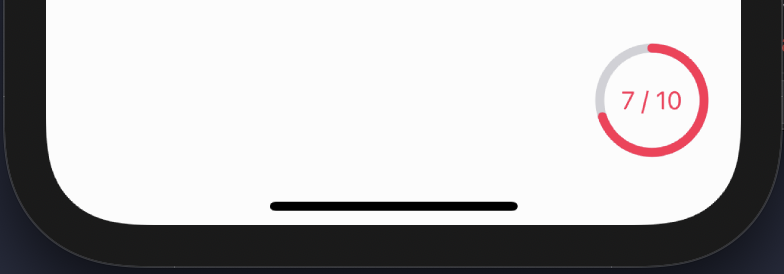

 <br />

## Requirements
* iOS 13.0 ~

 <br />

## Installation
* move to your xcode project file.
* Add this submodule file in your project.
````
// (필요하다면) $ git init
$ cd (your project)
$ git submodule add https://github.com/kimhyebeen/ios-submodule-circle-progress-bar.git
````

<br />

* Add this module in your xcode **(target > General > Frameworks, Libraries, and Embedded Content)**
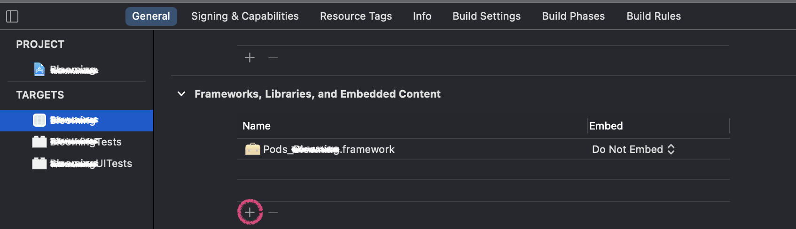
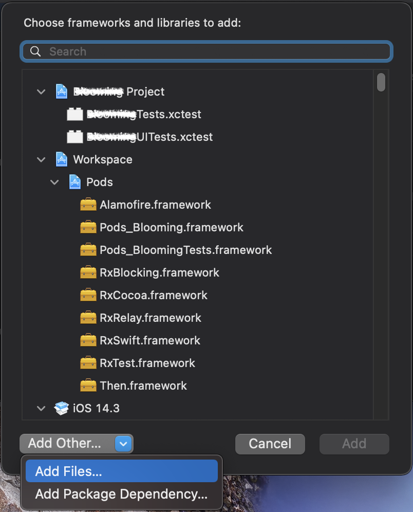
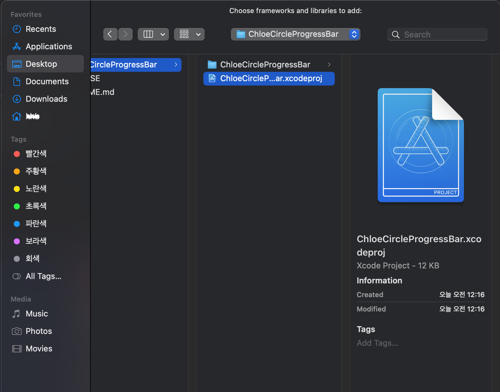
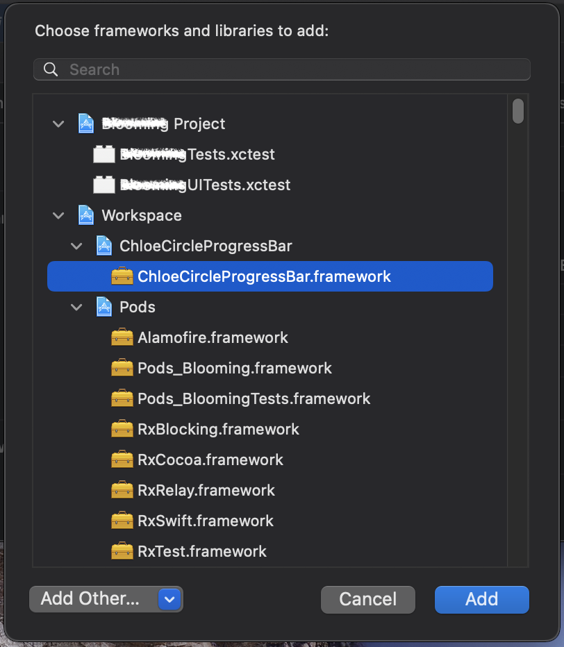

 <br />

## Usage
* import this module.
````swift
import HBCircleProgressBar
````

<br />

* create a property for CircleProgressBar
````swift
let circleProgress = HBCircleProgress(frame: CGRect(x: 0, y: 0, width: 60, height: 60))
````

<br />

* setting the progress value in your `HBCircleProgress`.

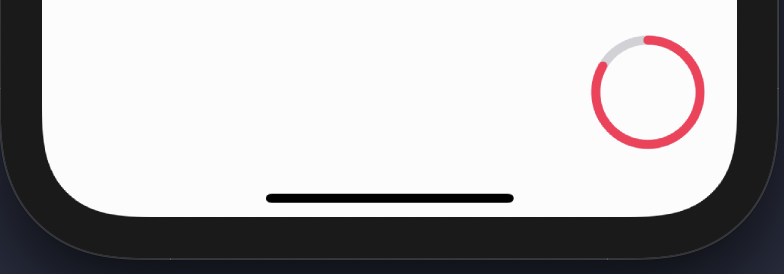

````swift
circleProgress.setProgress(value: 7/10) // 0.0 ~ 1.0
self.view.addSubview(circleProgress)

circleProgress.translatesAutoresizingMaskIntoConstraints = false
circleProgress.widthAnchor.constraint(equalToConstant: 60).isActive = true
circleProgress.heightAnchor.constraint(equalToConstant: 60).isActive = true
circleProgress.bottomAnchor.constraint(equalTo: self.view.bottomAnchor, constant: -40).isActive = true
circleProgress.trailingAnchor.constraint(equalTo: self.view.trailingAnchor, constant: -20).isActive = true
````

<br />

* you can add a label in your `HBCircleProgress`.


````swift
let label = UILabel()
label.text = "7 / 10"
label.font = .systemFont(ofSize: 14)
label.textColor = .systemPink
circleProgress.setupLabel(label)
````

 <br />


## Properties
* progressColor
  + `circleProgress.progressColor = .systemBlue`
  + 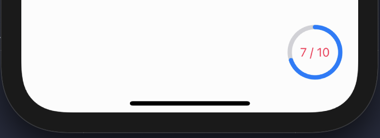
* trackColor
  + `circleProgress.trackColor = .systemBlue`
  + 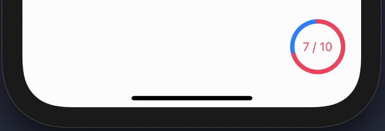
* fillColor
  + `circleProgress.fillColor = .systemYellow`
  + 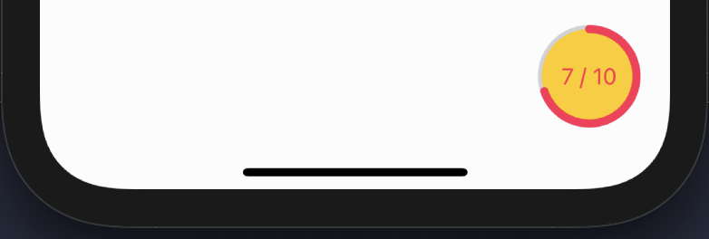
* progressLineWidth
  + `circleProgress.progressLineWidth = 9.0`
  + 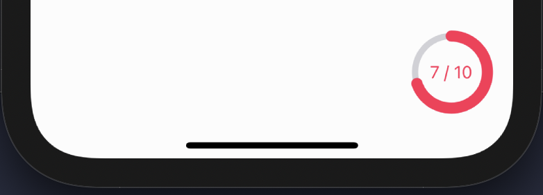
* progressLineWidth & trackLineWidth
  + `circleProgress.trackLineWidth = 10.0`
  + `circleProgress.progressLineWidth = 10.0`
  + 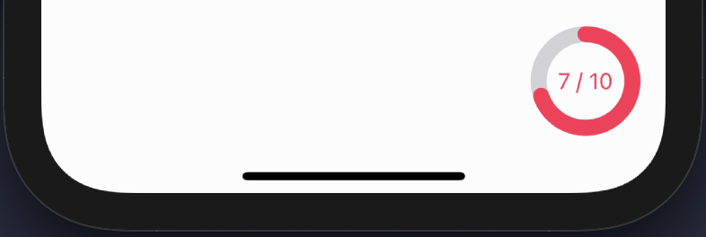

 <br />

## References
* [Git submodule 써보기 + 삭제하는 법](https://zeddios.tistory.com/704)
* [Git submodule 사용하기](https://pinedance.github.io/blog/2019/05/28/Git-Submodule)
* [Create Circular Progress Bar in iOS](https://www.tutorialspoint.com/create-circular-progress-bar-in-ios)

<br />

## 🚀 License
The MIT License (MIT)

Copyright (c) 2021 김혜빈 (HB)

_Permission is hereby granted, free of charge, to any person obtaining a copy of this software and associated documentation files (the "Software"), to deal in the Software without restriction, including without limitation the rights to use, copy, modify, merge, publish, distribute, sublicense, and/or sell copies of the Software, and to permit persons to whom the Software is furnished to do so, subject to the following conditions:_

_The above copyright notice and this permission notice shall be included in all copies or substantial portions of the Software._

_THE SOFTWARE IS PROVIDED "AS IS", WITHOUT WARRANTY OF ANY KIND, EXPRESS OR IMPLIED, INCLUDING BUT NOT LIMITED TO THE WARRANTIES OF MERCHANTABILITY, FITNESS FOR A PARTICULAR PURPOSE AND NONINFRINGEMENT. IN NO EVENT SHALL THE AUTHORS OR COPYRIGHT HOLDERS BE LIABLE FOR ANY CLAIM, DAMAGES OR OTHER LIABILITY, WHETHER IN AN ACTION OF CONTRACT, TORT OR OTHERWISE, ARISING FROM, OUT OF OR IN CONNECTION WITH THE SOFTWARE OR THE USE OR OTHER DEALINGS IN THE SOFTWARE._
